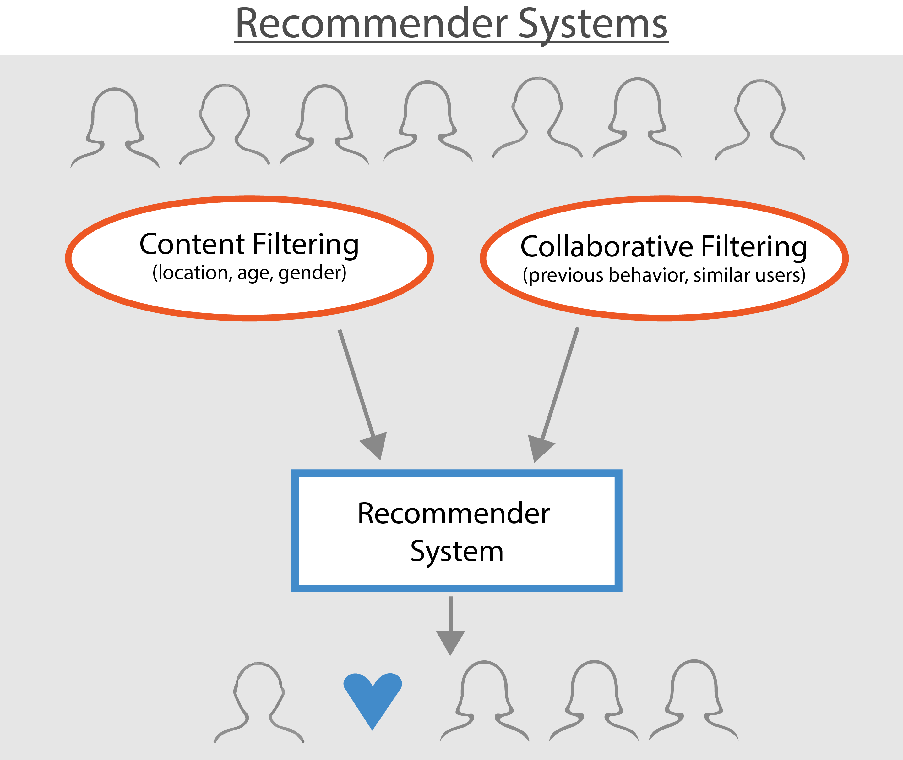

# Marketing Campaign Recommendations

## Problem Statement

The marketing team at TELUS is interested in increasing adoption of our internet product through existing or new campaigns. Using this provided datasets, please build a model (or models) and provide corresponding recommendation(s) to help the marketing team launch the most effective campaigns. A few notes:

- Be as creative as you want from types of model to analysis to presentation
- There are existing campaigns and offers for internet that can be leveraged or new campaigns can be launched
- There is a limited campaign budget (i.e. not all recommendations can be implemented) and most campaigns have a capacity limit (i.e. only select subscribers 	can be contacted)
- The target audience is existing subscribers who do not have internet currently

## Overview of Generic Recommender Systems

| 
|:--:| 
| [Source](https://www.datacamp.com/community/tutorials/recommender-systems-python): Recommender Systems in Python |

## Content Based Recommenders
Content based is the most intuitive approach to recommender systems design, and use uses item properties to determine if a particular item has enough similarity (probabilistically high) to a customer's profile properties to be promoted in a page-ad or a campaign design. A very interesting use-case is e-commerce where search terms are used to filter the most similar items to recommend to customer 

## Collaborative Filtering Recommenders
Collaborative Filtering (CF) does not use information about the product, but rather the recommendations and input from other users to create a matrix of likeness, based oin which to create a product ranking without any knowledge of product content. This is popularized by streaming platforms like Netflix.

## Executive Summary
In the case of internet campaign design I spend all the time I had in Exploratory Data Analysis to better understand my data and perform basic cleaning/filtering/sanitization on them.

In analyzing the customers who currently have/do not have internet connection, I had intended to identify the properties that showed a better han 70% correlation to the "PROD_INTERNET" property. Based on the these properties, I had intended to narrow down a set of features that could be used to build model the model and predictor. The challenge in this particular case is:
1. Many properties are textual (non-numeric) and to convert them to vectors using one-hot labeling increase dimensionality way too high (more than 100 columns). There is the possibility of using PCA, which I did not have time to explore
2. There is some correlation in the data as problem statement sates: _"one account can have multiple subscribers"_. I did not really look into this, but almost 1.4 accounts have multiple subscription and I am not sure how it will skew analysis
3. The property **"Price Plan"** is particularly interesting because it is textual content that cannot be vectorized with simple tokenization techniques.

Further analysis would be given based on the analysis graphs in [`jupyter notebooks older`](/notebooks).
